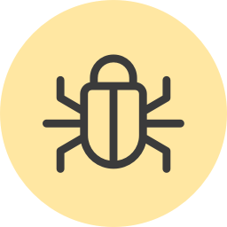

# CrawlerDetect plugin for Craft CMS

Use CrawlerDetect to detect 1.000's of bots/crawlers/spiders in Craft.



## Installation

To install CrawlerDetect, follow these steps:

1. Download & unzip the file and place the `crawlerdetect` directory into your `craft/plugins` directory
2. Install plugin in the Craft Control Panel under Settings > Plugins
3. The plugin folder should be named `crawlerdetect` for Craft to see it.

CrawlerDetect works on Craft 2.4.x and Craft 2.5.x.

## CrawlerDetect Overview

The CrawlerDetect library is a PHP class for detecting bots/crawlers/spiders via the user agent and http_from header. Currently able to detect 1,000&#39;s of bots/spiders/crawlers.

## Using CrawlerDetect

Detect if bot/crawler:
```twig
 .. 
```

Pass a user agent as a string:
```twig
 .. 
```

Output the name of the bot that matched (if any)

```twig

```

## Credits

[CrawlerDetect](https://github.com/JayBizzle/Crawler-Detect) by Mark Beech.

Brought to you by [Superbig](https://superbig.co)
